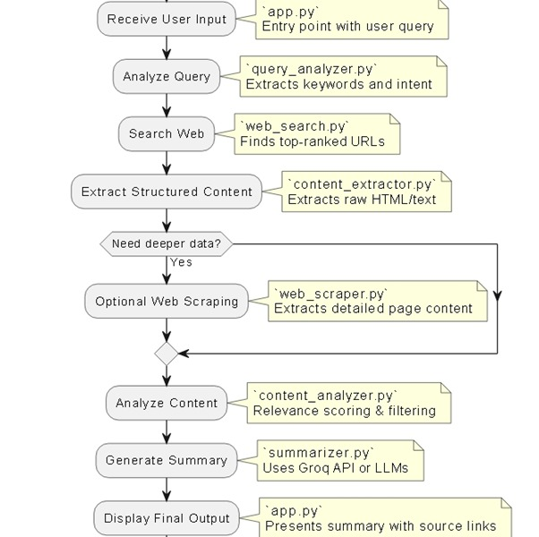

# Web_Research_Agent

An AI-powered research assistant that automates web research by understanding queries, performing web searches, scraping relevant content, and generating summarized reports using Groq LLM and SerpAPI. Built with modular agents and an intuitive Streamlit UI.

---

## 📌 Features

- 🔍 Query understanding using Groq API
- 🌐 Web search integration via SerpAPI
- 🧽 Clean content extraction using BeautifulSoup
- 🧠 AI-based summarization
- 📄 Aggregated final summary from multiple sources
- 🚀 Easy-to-use interface with Streamlit

---

## 🧠Architecture


---

## ⚙️ Agent-Based Workflow

### 1. Query Analyzer (`query_analyzer.py`)
- Uses Groq API to:
  - Analyze user input
  - Identify query type (news, opinion, etc.)
  - Extract top keywords
  - Detect intent

### 2. Web Search (`web_search.py`)
- Uses SerpAPI
- Fetches top Google results
- Returns: title, snippet, and URL

### 3. Web Scraper (`web_scraper.py`)
- Uses `requests` with headers
- Handles unreachable sites and timeouts
- Returns raw HTML

### 4. Content Extractor (`content_extractor.py`)
- Cleans and extracts main content
- Filters ads, navigation, headers/footers
- Ensures readable and focused text

### 5. Content Analyzer (`content_analyzer.py`)
- Forms a custom prompt for summarization
- Uses Groq’s LLM to:
  - Generate a query-relevant summary
  - Highlight key points, facts, insights

### 6. Summarizer (`summarizer.py`)
- Optionally merges all article summaries
- Useful for long-form research reports

---

## 🚀 Getting Started

### 1. Clone the repository

```bash
git clone https://github.com/your-username/web-research-agent.git
cd web-research-agent
```
2. Install dependencies
```bash
pip install -r requirements.txt
```

3. Set up your .env file
```env
GROQ_API_KEY=your_groq_api_key
SERPAPI_API_KEY=your_serpapi_key
```

4. Launch the Streamlit App
```bash
streamlit run app.py
```

